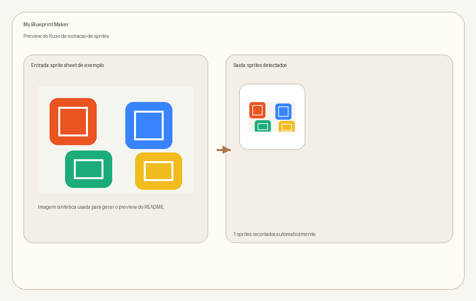

# Blueprint Maker


Plugin para GIMP 3+ com reaproveitamento do extrator de sprites original do projeto.

Versao atual: 1.1.1.

## Preview



Preview gerado a partir de uma execucao real do extrator sobre uma sprite sheet sintetica, mostrando a entrada e o recorte produzido pelo fluxo atual.

## Descricao

O projeto agora funciona principalmente como um plugin do GIMP 3+ para detectar sprites na camada ativa e criar uma nova imagem para cada sprite detectado. O nucleo de deteccao continua em Python/OpenCV e o modo Qt standalone ainda permanece disponivel no repositorio.

## Funcionalidades

- Detecta sprites automaticamente a partir da camada selecionada
- Reaproveita suporte a transparencia, rembg e upscale do motor atual
- Gera uma nova imagem no GIMP para cada sprite detectado ou uma unica imagem com camadas
- Permite ajustar threshold, area minima, layout e opcoes de IA
- Abre uma tela inicial de configuracao antes da extracao no GIMP, com preview de deteccao e mascara

## Instalacao

### Pre-requisitos

- Python 3.8 ou superior
- GIMP 3+ com suporte a plugins Python
- Dependencias Python do projeto instaladas no Python que sera usado pelo plugin

### Instalar a partir da release

1. Extraia o conteudo da release em uma pasta local.
2. Instale as dependencias:

```bash
pip install -r requirements.txt
```

3. Execute o instalador que ja acompanha a release:

```bash
python install_gimp_plugin.py
```

O pacote de release agora inclui o `install_gimp_plugin.py`, entao nao e mais necessario voltar ao repositorio para concluir a instalacao.

### Plugin do GIMP 3+

1. Clone este repositorio ou abra a pasta do projeto.

2. Instale as dependencias do projeto:

```bash
pip install -r requirements.txt
```

3. Instale automaticamente na pasta de plugins do GIMP 3:

```bash
python install_gimp_plugin.py
```

Se voce instalou o projeto como pacote Python, tambem pode usar:

```bash
blueprint-maker-install-gimp
```

Ou, se preferir, copie manualmente a pasta do projeto para a pasta de plugins do GIMP 3.

No Windows, o caminho mais comum e:

```text
%APPDATA%\GIMP\3.x\plug-ins\blueprint-maker
```

O instalador agora tenta detectar automaticamente a versao de perfil mais recente, como 3.0 ou 3.2.

4. Garanta que os arquivos `blueprint-maker.py`, `extrator_sprites_gimp.py`, `external_sprite_runner.py` e `install_gimp_plugin.py` estejam dentro da pasta da release ou do repositorio. Ao instalar no GIMP, a pasta de plugin precisa conter `blueprint-maker.py`, `extrator_sprites_gimp.py`, `external_sprite_runner.py`, `README.md`, `requirements.txt` e os pacotes `core`, `components`, `gui`, `locales` e `resources`.

Se o Python do GIMP nao tiver numpy/opencv disponiveis, o plugin usa automaticamente o Python externo configurado durante a instalacao para executar a extracao. Essa configuracao fica registrada em `plugin_runtime_config.json`.

5. Reinicie o GIMP.

### Destino customizado

Se quiser instalar em outra pasta de plugins ou testar sem tocar no perfil padrao do GIMP:

```bash
python install_gimp_plugin.py --target C:/caminho/para/plug-ins/blueprint-maker
```

O parametro `--target` e util para testar a instalacao sem alterar o perfil padrao do GIMP.

## Uso no GIMP

Depois de reiniciar o GIMP, abra uma imagem com sprite sheet, selecione a camada desejada e execute:

```text
Filtros > Blueprint Maker > Extrair sprites para nova imagem
```

O plugin abre uma tela inicial de configuracao com preview de deteccao e mascara. Ao concluir, voce pode gerar uma nova imagem separada para cada sprite detectado ou uma unica imagem com camadas.

### Parametros principais

- Threshold: controla a sensibilidade da mascara
- Area minima: ignora ruido pequeno
- Layout: aceita vazio, 2x2, 2x3 ou 3x2
- Remover fundo: usa rembg se estiver instalado
- Upscale: aceita none, fsrcnn ou edsr

## Uso standalone

O modo Qt antigo ainda pode ser iniciado com:

```bash
python main.py
```

Se o projeto estiver instalado como pacote, o entry point equivalente e:

```bash
blueprint-maker
```

## Tipos de sprite sheet suportados

- PNG com transparencia
- JPG ou PNG com fundo solido
- Arranjos regulares ou irregulares

## Tecnologias

- GIMP 3 Python API
- OpenCV
- NumPy
- PyQt6

## Dicas

- Para sprites com transparencia, use threshold baixo
- Para fundos claros, aumente o threshold
- Aumente a area minima para reduzir falsos positivos

## Solucao de problemas

Sprites nao detectados:
- Ajuste o threshold
- Reduza a área mínima
- Verifique se há contraste suficiente entre sprite e fundo

Muitos sprites falsos:
- Aumente a área mínima
- Ajuste o threshold

O menu nao aparece no GIMP:
- Confirme que o GIMP 3 foi instalado com suporte a plugins Python
- Rode python install_gimp_plugin.py para copiar a estrutura correta do plugin
- Se estiver usando a release empacotada, confirme que o arquivo install_gimp_plugin.py veio junto no pacote extraido
- Confirme que o plugin foi instalado no perfil ativo do GIMP, por exemplo %APPDATA%/GIMP/3.2/plug-ins/blueprint-maker
- Confirme que os arquivos blueprint-maker.py e extrator_sprites_gimp.py estao em uma pasta de plugins lida pelo GIMP
- Verifique se as dependencias Python do projeto estao disponiveis para o Python embutido do GIMP
- Se numpy/opencv nao estiverem disponiveis no Python do GIMP, reinstale o plugin a partir do repositorio para atualizar o arquivo plugin_runtime_config.json com o Python externo correto

## Estrutura esperada da release

Uma release valida deve conter pelo menos:

- `install_gimp_plugin.py`
- `blueprint-maker.py`
- `extrator_sprites_gimp.py`
- `external_sprite_runner.py`
- `README.md`
- `requirements.txt`
- `plugin_runtime_config.json`
- pastas `components`, `core`, `gui`, `locales` e `resources`

## Licenca

Distribuido sob a licenca GPL-3.0. Consulte o arquivo LICENSE para os termos completos.

## Autor

Desenvolvido por Antigravity.
