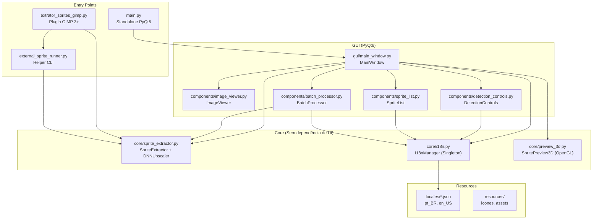
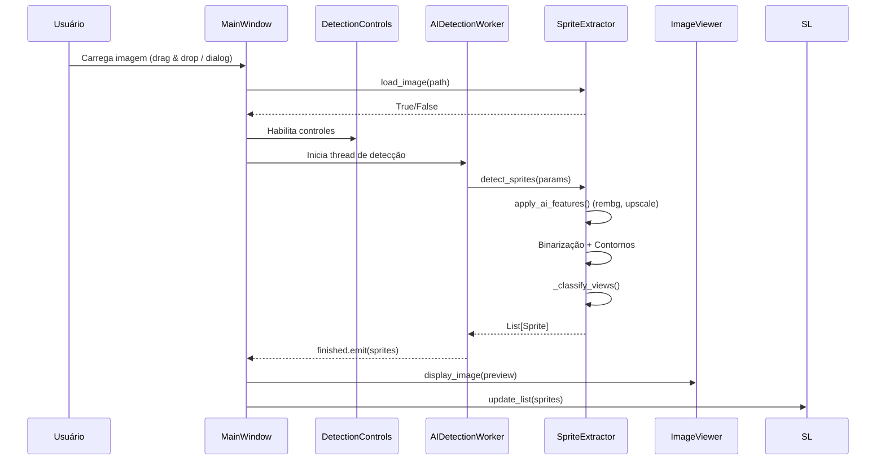

# Arquitetura — My Blueprint Maker

> Mapa completo do projeto para permitir decisões informadas (Diretriz: Profundidade/CoT).

---

## Visão Geral

O My Blueprint Maker é um **extrator de sprites** que opera em dois modos:

1. **Plugin GIMP 3+** — Integrado ao GIMP via Python-Fu, com dialog GTK nativo
2. **Standalone Qt** — Aplicação desktop independente com PyQt6

O núcleo de detecção (`core/`) é compartilhado entre os dois modos.

---

## Diagrama de Componentes



---

## Fluxo de Dados Principal



---

## Decisões Arquiteturais e Trade-offs

### 1. Dual-mode (GIMP + Standalone)
- **Decisão:** Manter o core independente de UI, com dois front-ends separados.
- **Trade-off:** Duplicação de lógica de dialog (GTK vs PyQt6), mas desacoplamento total.
- **Alternativa descartada:** UI única com abstração — complexidade excessiva para o benefício.

### 2. External Runner para GIMP
- **Decisão:** Quando o GIMP não tem numpy/opencv, usa `subprocess` para chamar Python externo.
- **Trade-off:** Overhead de serialização (RGBA via arquivo), mas compatibilidade garantida.
- **Mecanismo:** `plugin_runtime_config.json` armazena o caminho do Python externo.

### 3. OpenCV para Detecção
- **Decisão:** Binarização + `findContours()` em vez de ML-based detection.
- **Trade-off:** Rápido e sem modelo, mas sensível a threshold e fundos complexos.
- **Compensação:** Suporte a `rembg` (ML) como pré-processamento opcional.

### 4. Thread Worker para Detecção
- **Decisão:** `QThread` com signals para não bloquear a UI durante operações de IA.
- **Risco:** O `SpriteExtractor` é manipulado na thread worker mas referenciado na main thread.
- **Mitigação necessária:** Deep copy ou mutex nos dados compartilhados.

### 5. Singleton para i18n
- **Decisão:** `I18nManager` como singleton com fallback pt_BR → en_US.
- **Trade-off:** Simples, mas não suporta troca de idioma em runtime sem reiniciar.

---

## Estrutura de Diretórios

```
blueprint_plugin/
├── .gemini/                  # Diretrizes para IA
│   └── STYLE.md
├── components/               # Componentes reutilizáveis de UI (PyQt6)
│   ├── batch_processor.py    # Processamento em lote
│   ├── detection_controls.py # Controles de parâmetros
│   ├── image_viewer.py       # Visualizador com zoom/pan/seleção
│   └── sprite_list.py        # Lista de sprites com thumbnails
├── core/                     # Lógica de negócio (sem dependência de UI)
│   ├── i18n.py               # Internacionalização
│   ├── preview_3d.py         # Preview 3D com OpenGL
│   └── sprite_extractor.py   # Motor de detecção e exportação
├── docs/                     # Documentação
│   ├── assets/               # PDFs, imagens
│   ├── ARCHITECTURE.md       # Este arquivo
│   └── QUALITY_CHECKLIST.md  # Checklist de qualidade
├── gui/                      # Janela principal (PyQt6)
│   └── main_window.py
├── locales/                  # Traduções (JSON)
├── resources/                # Ícones e assets visuais
├── tests/                    # Testes automatizados (pytest)
├── extrator_sprites_gimp.py  # Entry point: Plugin GIMP 3+
├── external_sprite_runner.py # Entry point: Helper CLI para GIMP
├── install_gimp_plugin.py    # Instalador do plugin
├── main.py                   # Entry point: Standalone Qt
├── pyproject.toml            # Configuração do projeto
└── requirements.txt          # Dependências
```

---

## Pontos de Extensão

| Ponto | Onde | Como Estender |
|-------|------|---------------|
| Novos modelos de upscale | `DNNUpscaler.models` dict | Adicionar entrada com URL, filename e scale |
| Novos formatos de export | `SpriteExtractor.export_sprites()` | Parâmetro `format` já suporta qualquer formato OpenCV |
| Novas formas 3D | `SpritePreview3D._draw_*()` | Adicionar método e entry no `body_type` |
| Novos idiomas | `locales/*.json` | Criar arquivo JSON com mesmas chaves |
| Novos layouts | `SpriteExtractor._classify_views()` | Adicionar elif para novo layout_hint |

---

## Dívida Técnica Conhecida

1. **Thread safety do SpriteExtractor** — Worker manipula estado compartilhado sem proteção
2. **Magic numbers** — border=20, tolerance=100 hardcoded sem constantes nomeadas
3. **print() em produção** — Deveria usar `logging` estruturado
4. **Testes de GUI** — Nenhum teste automatizado para componentes PyQt6
5. **Cobertura de testes do GIMP plugin** — Impossível testar sem GIMP instalado; considerar mocks
